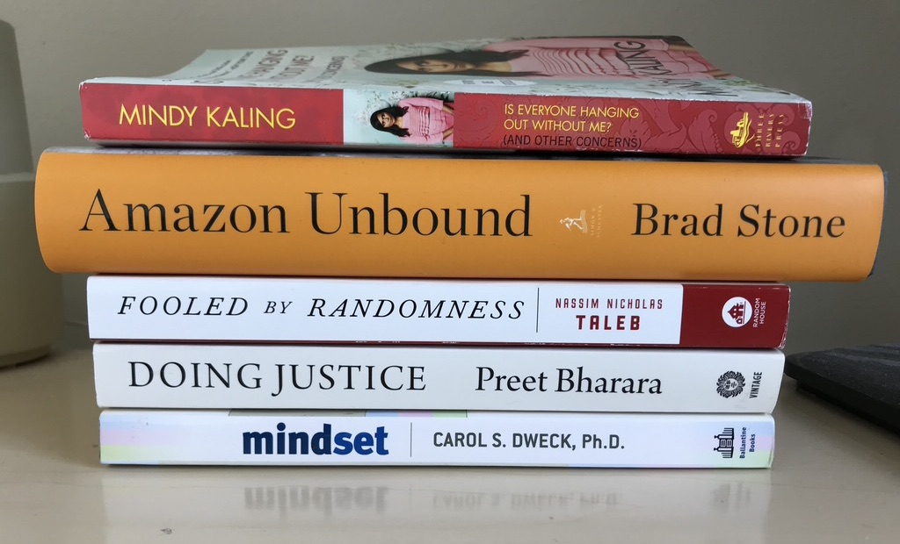

I read ten great books in 2021. I made a goal to read one book a month, and surprised myself by coming somewhat close. I really liked almost all of these books, partially because I dropped any book that didn't sustain my interest for long enough.

The thrill of getting into a book that evolves your understanding of the world, giving you a new lens with which to view things, or makes you (and your lived experience) feel seen is really profound.

Many of these books did these things for me, and I'd like to share them with you now. Let me know if you've read or enjoyed any of these books! In chronological order:

  

1. [Mindset: The New Psychology of Success](https://www.amazon.com/Mindset-Psychology-Carol-S-Dweck/dp/0345472322) - My first book after a long reading hiatus (basically all of 2020), this is a feel-good, self-help thriller that is sure to get your juices flowing. Beats to death the virtues of the superpower that is a “growth mindset”. I was kidding about it being a thriller, it is actually a pretty repetitive book.

2. [Doing Justice: A Prosecutor’s Thoughts on Crime, Punishment and the Rule of Law](https://www.amazon.com/Doing-Justice-Prosecutors-Thoughts-Punishment/dp/0525562931/) - War stories from Preet Bharara, the nation’s top prosecuting attorney from 2009 to 2017. A gripping memoir from the soft-spoken badass who brought rogue hedge funds, the Mafia, money launderers, corrupt public officials, and cybercriminals to justice. Not to be missed. (Confession: Showtime's *Billions* brought me to this book. Paul Giamatti's character is modeled loosely after Preet.)

3. [Fooled by Randomness](https://www.amazon.com/Fooled-Randomness-Hidden-Markets-Incerto/dp/0812975219) - If you think that everything that’s wrong with the world can be boiled down to sampling biases (survivorship, availability, ...), or compare yourself to others more than you should, read this book. First book in Nassim Nicholas Taleb’s “Incerto” series. (NNT: questionable behavior on Twitter, amazing thinker and writer.)

4. [Amazon Unbound](https://www.amazon.com/Amazon-Unbound-Invention-Global-Empire/dp/1982132612) - This was probably my favorite book of the year. A newly released, 500-page honeycomb of investigative journalism into the last decade of Amazon history, this is sure to delight. Particularly recommended if you are (1) a business geek or (2) interested in how various Amazon initiatives (Alexa, Go, India, AWS, Studios, Marketplace, Fresh, Logistics, Advertising) came to be OR (3) want the inside scoop on the Bezos-Sanchez story. Sequel to the “The Everything Store”.

5. [Freakonomics](https://www.amazon.com/Freakonomics-Economist-Explores-Hidden-Everything/dp/0060731338) - A super well-known book that actually lives up to its hype. If you like (over)applying economics to everyday life, or thinking about causality in the social sciences (e.g. what actually brought down crime in the 1990s?), don’t miss out.

6. [Is Everyone Hanging Out Without Me?](https://www.amazon.com/Everyone-Hanging-Without-Other-Concerns/dp/0307886271) - Writer and actress Mindy Kaling’s first memoir. If you enjoyed The Office or the teen dramedy Never Have I Ever (guilty), this is a tell-all from the wonderful person who brought those shows into existence. If you also secretly dream of moonlighting as a writer or professional comedian... why aren’t you reading this already?

7. [The Courage to be Disliked](https://www.amazon.com/Courage-Be-Disliked-Phenomenon-Happiness/dp/1501197274) - Not to be dramatic, but this book could change your life. Structured as a conversation between a troubled student and his philosopher-teacher, Courage is a primer on the teachings of Alfred Alder, one of three giants of Austrian psychology (along with Freud and Jung). Deliberates on bombshells like "trauma does not exist" and "all problems are interpersonal relationship problems" and explains how everyone can be happy and free. Self-help that is in a class of its own.

8. [Why Not Me?](https://www.amazon.com/Why-Not-Me-Mindy-Kaling/dp/0804138168) - This is Mindy Kaling's second memoir. Another amusing collection of vignettes from her now noticeably more glam life.

9. [Modern Romance](https://www.amazon.com/Modern-Romance-Aziz-Ansari/dp/0143109251) - An intriguing cross between a sociological study and a humor book, Aziz Ansari's Modern Romance explores love and dating in the 21st century.

10. [The Righteous Mind](https://www.amazon.com/Righteous-Mind-Divided-Politics-Religion/dp/0307455777) - This book is guaranteed to change your understanding of morality, and what it means to be liberal or conservative. It's a stunningly interesting exploration of the field of moral psychology and how it informs all aspects of our society, from political orientation and religion to the psychology of sports fans (aka tribalism in all its forms). Jonathan Haidt draws from sociology, philosophy, and evolutionary psychology, and is both scientific and engaging. A must read.

Honorable mentions - book I did not finish, but wish I had:

- [Grit](https://www.amazon.com/Grit-Passion-Perseverance-Angela-Duckworth/dp/1501111108) - This book and Mindset go hand-in-hand. Just as Carol Dweck canonized the idea of a "growth mindset" (a concept that has even made its way into Microsoft's [corporate principles](https://careers.microsoft.com/us/en/culture)), Angela Duckworth made "grit" THE prior art in any conversation on success, sustained achievement, and resiliency. Read it if you like this kind of thing (no judgment).

- [Staff Engineer](https://www.amazon.com/Staff-Engineer-Leadership-beyond-management/dp/1736417916) - I read a big chunk of this on a flight from Boston, and learned a lot. Books about the career path I’m actually on stress me out, so I didn’t finish it.

- [The Blank Slate: The Modern Denial of Human Nature](https://www.amazon.com/Blank-Slate-Modern-Denial-Nature/dp/0142003344) - Steven Pinker is the world's preeminent cognitive scientist, and if you’re at all suspicious that the nature-vs-nurture debate is not settled, this book is for you. Answers important questions like: how much influence do parents really have on their kids' personalities? It's long, but it's a masterpiece and worth it. Read it.

- [Elon Musk: Tesla, SpaceX, and the Quest for a Fantastic Future](https://www.amazon.com/Elon-Musk-SpaceX-Fantastic-Future/dp/006230125X) - I read the first quarter of this. Insightful look into what made Musk into the person he is today, and the origins of all his companies. Wasn't enough of a "stan" to finish it.

- [How to Lead](https://www.amazon.com/How-Lead-Greatest-Founders-Changers/dp/1982132159) - A collection of 30 short interviews conducted by private equity giant David Rubenstein with various leaders in business and politics - from Bezos and Branson to Bush, Clinton, and Fauci, among many others. Read exactly half of this book (all the business parts, none of the politics parts) before I dropped it and mailed it to a friend.

---

So which books were my absolute favorites? Of the ten I finished, these were my top 5:

1. Amazon Unbound
2. The Righteous Mind
3. The Courage to be Disliked
4. Doing Justice
5. Fooled by Randomness

Read any of these books, or have any thoughts? Let me know what you think in the comments!