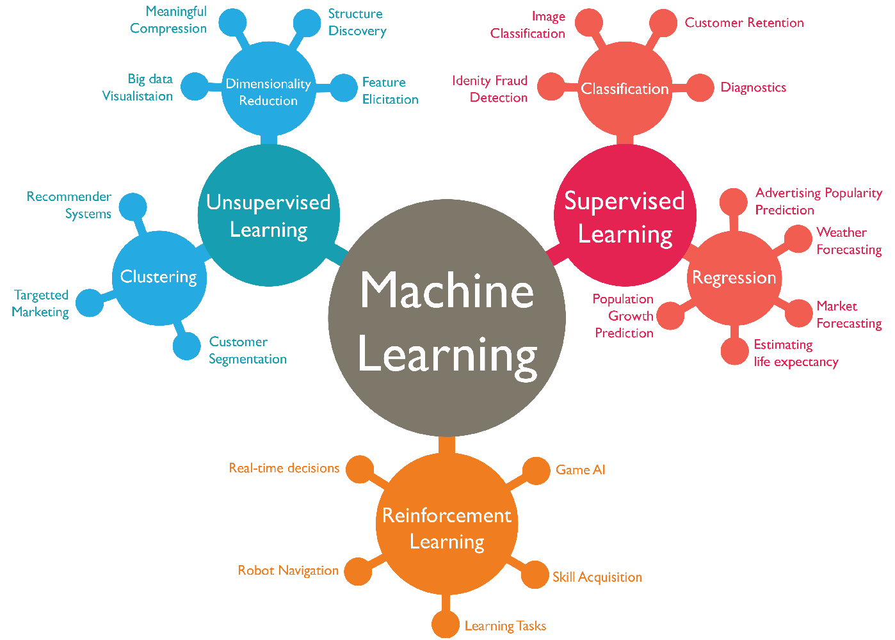

Machine learning is a deep and broad enough field that it could be its own college major. If I was designing a machine learning major, here are the core classes I would include. (This can also serve as a personal study guide.)

For some topics, I've linked to a set of class notes or textbook that I've used and enjoyed. I favor class notes wherever possible.

Let me know if I’m missing something! (or if you just love any of these topics!)

 

  

### Core

Foundations

- [Artificial Intelligence](https://www.amazon.com/Artificial-Intelligence-Modern-Approach-Global-dp-1292153962/dp/1292153962/)

- [Statistical Learning](../assets/ml/cs189-notes.pdf)

- [Deep Learning](https://www.youtube.com/playlist?list=PL3FW7Lu3i5JvHM8ljYj-zLfQRF3EO8sYv)

- Reinforcement Learning [1](#rl)

Theory

- Statistical Learning Theory [2](#slt)

- Probabilistic Graphical Models [3](#pgm)

Systems

- [Computer Architecture](https://www.coursera.org/learn/comparch)

- [Distributed Systems](https://www.cs.princeton.edu/courses/archive/fall16/cos418/syllabus.html)

Applications

- Computer Vision [4](#cv)

- Natural Language Processing [5](#nlp)

- Speech Recognition

- Robotics

- Time Series Forecasting

### Background

Programming

- Python (with numpy)

Mathematics

- Probability & Statistics

- [Linear Algebra](https://www.amazon.com/Linear-Algebra-Applications-Richard-Penney/dp/0470178841)

- Multivariable Calculus

### Enrichment

Mathematics

- Optimization

- Information Theory

Biology

- Neuroscience

- Cognitive Psychology [6](#psy)

Electrical Engineering

- Signal Processing

### Footnotes

Class notes I haven't used, but that I'd recommend:

<a name="rl">1</a>: Check out Stanford's CS 234 [video lectures](https://www.youtube.com/playlist?list=PLoROMvodv4rOSOPzutgyCTapiGlY2Nd8u) or David Silver (Deep Mind)'s [course](https://deepmind.com/learning-resources/-introduction-reinforcement-learning-david-silver).

<a name="slt">2</a>: Check out Stanford's STATS 214 [class page](http://web.stanford.edu/class/stats214/) for references to some good SLT resources. Percy Liang's [notes](https://web.stanford.edu/class/cs229t/2017/Lectures/percy-notes.pdf), in particular, look good.

<a name="pgm">3</a>: Check out Stefano Ermon's (rather concise) [notes](https://ermongroup.github.io/cs228-notes/).

<a name="cv">4</a>: Check out Stanford's CS 131 [syllabus](http://vision.stanford.edu/teaching/cs131_fall1920/syllabus.html) and [lecture notes](https://github.com/StanfordVL/CS131_notes).

<a name="nlp">5</a>: Check out Stanford's CS 224N [syllabus](http://web.stanford.edu/class/cs224n/index.html#schedule) and [video lectures](https://www.youtube.com/playlist?list=PLoROMvodv4rOhcuXMZkNm7j3fVwBBY42z).

<a name="psy">6</a>: I can't miss an opportunity to shill Steven Pinker. Check out his PSY 101 [videos](https://stevenpinker.com/psy-1-introduction-psychological-science-lectures).

