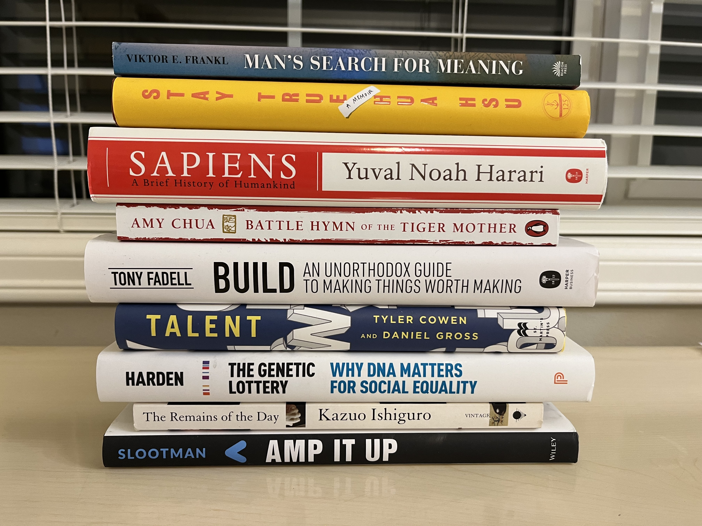

I read nine books in 2022, three short of my [goal of twelve](https://www.goodreads.com/user_challenges/32652493) and one less than last year. 

Among them, I read three business books, three memoirs, one novel, and two science books. Given that I was on the job market this year, this distribution makes some sense!

  

Here's a bit about each one:

1. [Amp It Up](https://www.amazon.com/Amp-Unlocking-Hypergrowth-Expectations-Intensity/dp/1119836115/) - Frank Slootman is Snowflake's hard-charging, no-nonsense CEO, known for his Dutch candor and hyperfocused leadership style. This book is a concise, no-frills guidebook to his philosophy on business and management. Despite the book's generic-sounding title, Slootman delivers non-obvious insights, distilled from his experience leading three iconic software-as-a-service companies.

    One of my favorite "Slootmanisms" is his pithy take on evaluating talent: "Education matters. Experience matters more. Aptitude matters most." Sounds obvious, but is actually somewhat heretical. Fun fact: Frank responds to cold-emails, including one I sent him about an interview he did with Bloomberg! Interesting guy, interesting book.

2. [The Remains of the Day](https://www.amazon.com/Remains-Day-Kazuo-Ishiguro/dp/0679731725/) - 

3. [The Genetic Lottery: Why DNA Matters for Social Equality](https://www.amazon.com/Genetic-Lottery-Matters-Social-Equality/dp/0691190801) - 

4. [Talent](https://www.amazon.com/Talent-Identify-Energizers-Creatives-Winners/dp/1250275814) -

5. [Build: An Unorthodox Guide to Making Things Worth Making](https://www.amazon.com/Build-Unorthodox-Guide-Making-Things/dp/0063046067) -

6. [Battle Hymn of the Tiger Mother](https://www.amazon.com/Battle-Hymn-Tiger-Mother-Chua/dp/0143120581/) - 

7. [Sapiens](https://www.amazon.com/Sapiens-Humankind-Yuval-Noah-Harari/dp/0062316095) - 

8. [Stay True](https://www.amazon.com/Stay-True-Memoir-Hua-Hsu/dp/0385547773) - 

9. [Man's Search for Meaning](https://www.amazon.com/Mans-Search-Meaning-Viktor-Frankl/dp/080701429X) - 

My favorite books were: Man's Search for Meaning, Battle Hymn of the Tiger Mother, and Sapiens. Honorable mention goes to The Remains of the Day (the movie is even better!)

